# 一、Google Analytics是什么
谷歌分析（Google Analytics）是一个免费的数据分析工具，帮助企业了解网站流量及用户行为。视频内容分为四个部分：首先介绍GA的功能及其对企业的帮助；其次讲解GA的数据分类与常用指标，如跳出率和平均浏览时长；第三部分探讨企业关注的关键指标及其对网站改进的影响；最后，介绍GA的账户结构和数据视图设置，强调如何通过数据分析优化广告效果和用户体验。通过这些知识，企业能更有效地进行市场推广和客户管理。
* 了解谁到过您的网页，他们再您的网站里的互动行为
* 将销售功劳和转化功劳分配给各个媒体渠道，让您更有效的利用高效益的渠道作线上推广
* 根据数据资料，持续调整测试并优化网站与线上广告投放，达到更好的成效
---
## GA主要功能
* 流量监测
* 用户行为分析
* 转化跟踪
* 受众分析
* 实时数据
* 电子商务分析
* 自定义报告
* 集成与API
# 二、GA的数据分类结构（我们会采用哪些模块查看报告）
## 1.GA账户结构
### 账号
- [analytics.google.com.](analytics.google.com.)在创建谷歌账号时，用户可以选择使用已有的电子邮件地址来注册，避免重复创建新账户。成功创建后，用户将收到一封确认邮件，表明他们获得了谷歌分析账户的管理权限。
- 在创建账号的时候会出现账号数据共享设置，推荐都勾选，如果说像“账号专家”或者“技术支持”没有勾选的话，如果在之后的使用途中，遇到了任何问题想要请google内部进行协助可能就没有办法看到账户了。输入需要监测的网站域名，输入行业和企业规模信息，点击创建。
- 成功关联Google账户后，用户需要进行一些设置以优化数据视图。这包括选择合适的视图，并定义受众群体，以便更有效地进行广告投放和营销活动。
-创建好之后可以看到GA的三大块结构：账号设置、媒体资源、数据收集
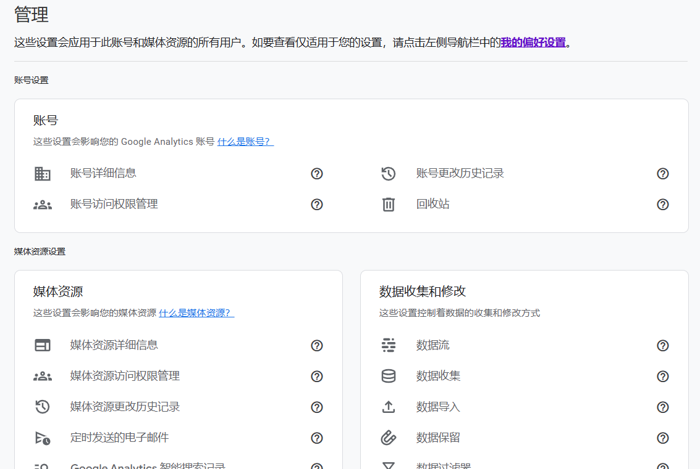
=======
- 账号设置：
1. 账号名称以及商家所在的一些国家地区，下面是一些数据共享设置和google支持的一些设置，推荐都勾选上。
2. 账号用户管理，这个地方可以邀请一些其他的邮箱和我们协作管理这些账户，我们可以添加一些账户用管理的权限（记得把：通过电子邮件通知新用户选项给勾选上）
- 媒体资源：
1. 媒体资源设置，可以创建多家媒体资源，比如阿里旗下有支付宝、天猫等不同的子公司，这个时候不把淘宝和支付宝的业务混在一起进行查看，所以就需要创建不同的媒体资源；不同的资源追踪ID就不一样，ID不同回传的数据就不一样。有的ID里面有UA-这是老版的GA（universal analytics），有的里面没有，是GA4
2. **GA和GA4的区别，我们分别要做在什么情况下去使用？** 如果海外推广业务主要是通过网站来卖品或者是吸引询盘，那儿我们用老版的企业即UA-开头的就足够了，如果推广的业务包含了网站页，您自己也开发了APP的话我们可以使用新版的GA4进行宣传
3. 跟踪信息，需要把全局网站代码那个框里面的代码copy past到您的网站上的每一页的head之间；如果说账户已经有优化师的支持，这一步不需要做优化师会直接通过google tag manager帮助您去实现；GA4里面是有一个wordpress直接的按键，按照步骤提示去添加插件设置就可以。
4. 引荐排除列表，比如说我们去看数据的时候会发现一些referal-引荐流量-外部链接点击进入你的网站或应用的访问者，是从PAYPAL来的，因为一些2C电商网站，客户在付款的时候他会跳转到PAYPAL界面，然后再从PAYPAL（经过广泛验证的支付平台，能够提供高水平的交易安全性）跳转回来，这个时候我们会看到引荐来源是PAYPAL，但其实并不是PAYPAL推荐过来的只是客户跳出去付款了，因此可以在这里引荐排除列表添加 paypal.com，之后数据就不会把从PAYPAL来的流量归类为引荐流量。
5. 产品关联，在使用GA的时候最好和广告账户关联一下，这样广告账户的数据可以回传到GA，并且GA的一些指标比如跳出率，每次会话浏览时长这类指标也可以正常的回传到我们的广告账户，我们可以交叉看数据。
6. 受众群体定义，受众群体是方便我们之后去做广告进行在营销或者针对特定受众群体的一个广告投放，所以说这个时候去新加一个受众群体；通常来讲2B和2C的受众群体是不一样的
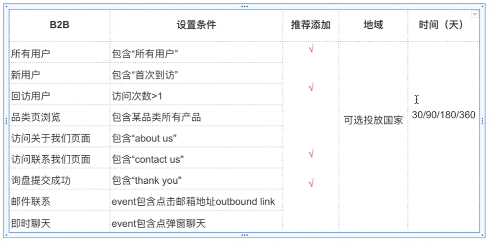
=======
在GA发出一个关联请求成功之后，我们可以到AD账户进行检查。
- 设置结算-已关联的账号，可以看到UA版和GA4、Firebase两个版本，点击自己之前做的版本进去，关联成功也有个地方需要修改，在观看次数那里修改-全部网站数据-importsitemetrics指标打开。多个数据表的话可以选择下面多个打开，通常选择默认的全部网站数据视图-保存即可。
- 数据视图，我们所有的信息都会出现在这个全部网站数据视图里面。
1. 排除公司内部流量，有时候不需要看全部网站的东西，知道公司的内部IP是哪些，我想把自己员工在自己网站上的行为流给去掉，这个时候数据视图就有一个选项-创建新的数据视图-过滤器设置即可。
2. 全部网站数据视图是不可更改的，因为在加了过滤器之后他会在加的当下的这一秒就开始过滤数据，如果说哪天想不过滤了，这个过滤条件可以删但是曾经被过滤掉的数据不可以回来了，这是一个不可逆的过程。所以一般来讲需要保留一个全数据的全部网站试图。
3. 目标-GADs类似于转化操作的一个东西，目标可以理解为转化。
4. 电子商务设置-针对于2C广告主-启用电子商务&启用增强型电子商务报告。两者的区别是，增强型反映的内容比前者更多
### 将 GA 标记代码添加到你的网站
- 如果使用的WordPress：
1. 安装 GA 插件：Site Kit by Google
2. 进入插件设置
3. 从Google Analytics 复制你的 Measurement ID.
4. 将 Measurement ID 粘贴至插件设置中的 GA tracking ID 栏
5. 在 Tracking Method options 中选择 Global Side Tag
6. 点击 Save Changes.
- 如果你使用的是 Wix
1. 进入 Marketing Integrations
2. 在 Google Analytics 下方点击 Connect.
3. 点击 Connect Google Analytics
4. 在弹出的窗口中粘贴你的 Measurement ID
5. 如果你希望对 Google 隐藏访问者的 IP 地址，请勾选 IP    Anonymization 复选框
6. 点击 Save.
7. 在这里设置分析指标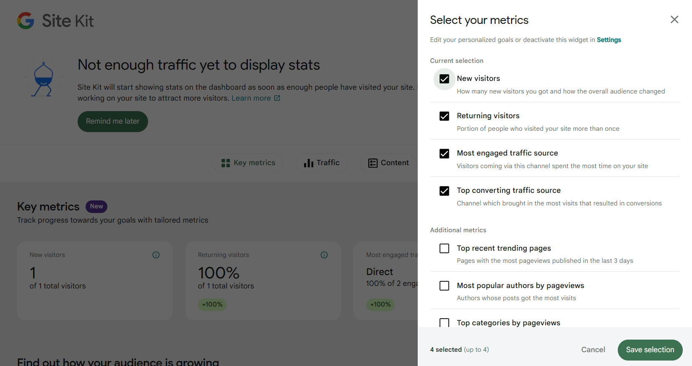
- 如果你使用的是其他 CMS/平台
Google 在[这里](https://support.google.com/analytics/answer/10447272?hl=en=)提供了大多数 CMS 说明的链接。 但是，你会注意到并非所有平台都为 GA4 中的新“G-”ID 提供支持。 因此，在某些情况下，你需要通过将完整的 gtag.js 代码复制到网站的 <head> 部分
或者，你可以使用 [Google Tag Manage (GTM)](https://support.google.com/tagmanager/answer/6102821?hl=en&utm_id=ad)。
- Google Tag Manage (GTM)
1. 打开要分析的网站
2. 点击扩展程序图标，点击Tag Assistant Legacy 
3. 点击Done 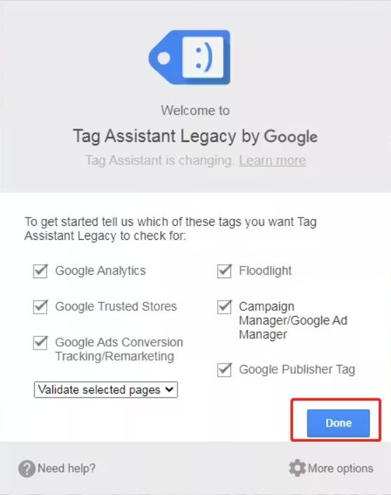
4. 点击Enable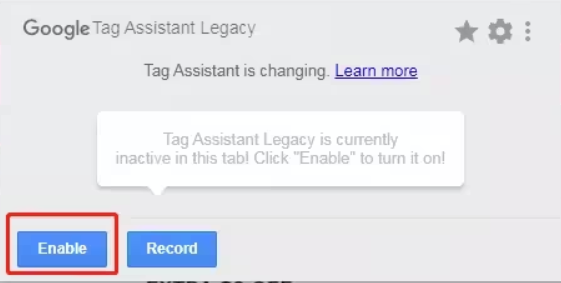
5. **刷新网页、刷新网页、刷新网页，重要的事情说三遍，刷新网页!!!**
6. 便可以在网站右上角看到代码安装详情，如果没出现，可以再点击一次Tag Assistant Legacy图标。
7. 这个插件就会抓取网站上的GA代码，如果代码状态时蓝色或者绿色就代表一切正常，如果时黄色或者红色就证明这个网站要么就是缺失了某些模块要么就是有一些排布的不正确比如放在head之间但他放在了body中间，就会导致追踪信息的不完整。
### 媒体资源
在媒体资源内，您可以查看报告，并管理数据收集、归因、隐私设置和产品关联。一个账号可以包含一个或多个媒体资源。
### 数据视图
## 2.GA的数据结构（报告类别）
### 实时报告
我们可以看到网站上的实时客户浏览情况
现在有哪些用户在，分别登陆的哪些网页，登陆地点在哪，关键作用：追踪GA的追踪代码有没有正常安装
### 受众群体
我们可以看到网站用户是从哪里来的，有什么样的背景，有什么样的画像特征
概览，提供目前的信息
主要是图表
### 流量获取
网站上的流量是从什么渠道来的，又可能是google ads数据cdc来的有可能是direct进来的
### 行为
客户在网站上面大概的行为流是什么样子，他们在网站上面做了什么
### 转化
客户在我们的网站上有没有实现我们想要追踪既定的转换操作，能实现他们的一些渠道和一些频率时间又具体行为是什么样子
# 三、一些用法
## 1.如何设置目标跟踪
Google Analytics 会自动开始衡量你网站的流量和用户交互，例如页面滚动、出站点击、网站搜索、视频参与和文件下载。
- 在Google Analytics网页点击管理
- 点击媒体资源设置
- 点击数据收集和修改
- 点击数据流
- 点击添加数据留来源（我是网站）如图所有这些自动跟踪的事件都可以选择标记为目标。 任何其他目标，例如完成表单、或电话呼叫，都需要使用 GTM 设置为事件。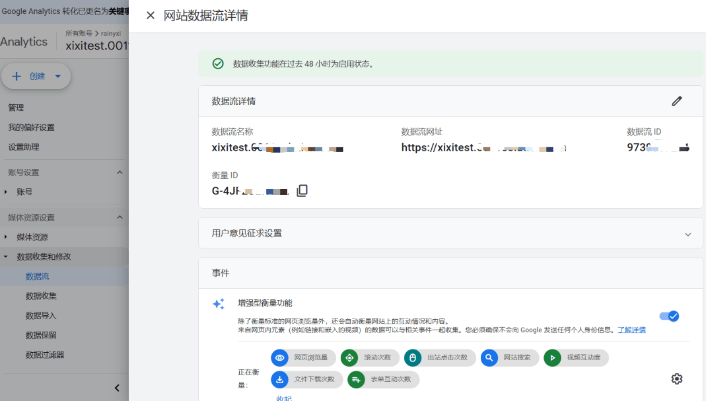
- 这个页面往下滚，google代码-配置代码设置-管理自动事件检测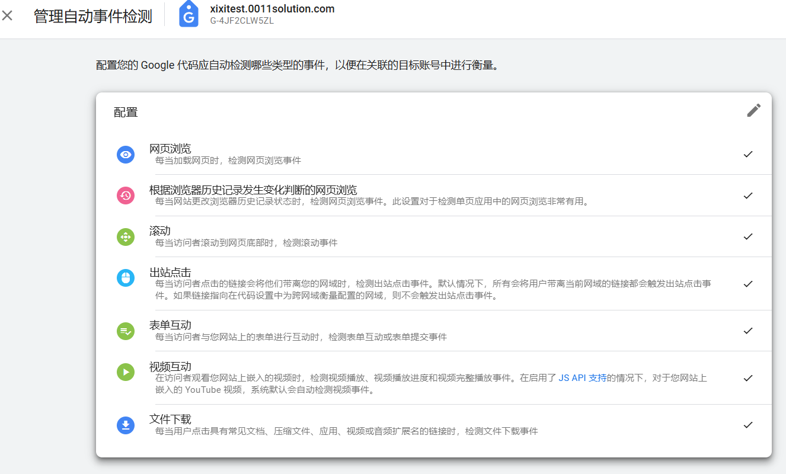
- 切换按钮，即可激活触发转换
## 2.如何使用 Google Analytics
如何使用 GA4 了解用户如何访问你的网站、他们在那里做什么、以及客户采取的多渠道旅程的基础知识。
## 3.Acquisition（获客）
Acquisition（获客）报告会告诉你**用户如何访问你的网站**。
GA4中，这分为两类：User Acquisition（用户获取）和 Traffic Acquisition（流量获取）。
用户获取报告基于用户参与度，而流量获取基于会话参与度。 这种区别很重要，因为一个用户可以有多个会话。 因此，下面我们将解释用户获取报告。
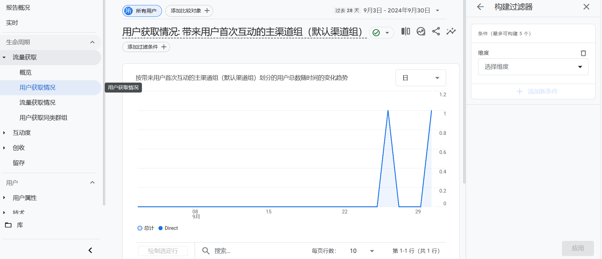
你可以通过添加用户人口统计、设备或自定义事件（如特定优惠券代码）的比较来细分你的报告。
现在，让我们使用高级视图并将其保留为“所有用户”：
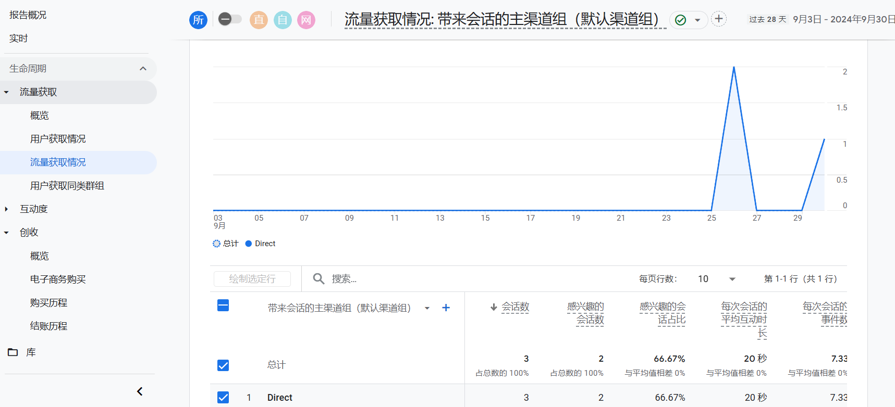
右上角那个铅笔，可以自定义报告是散点图、气泡图还是折线图柱状图。用户获取流量的途径，表格第一列中的维度选择了 “First user medium（第一用户媒介）”。 这向我们展示了最初获取用户的来源。
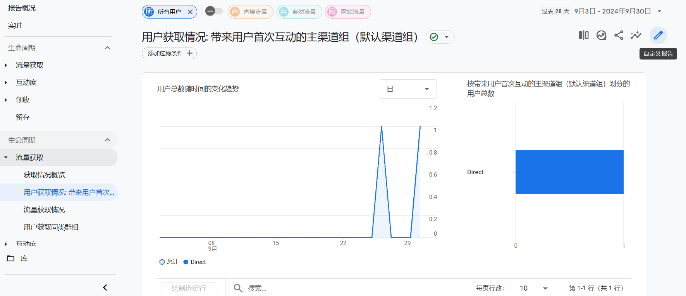
## 4.Engagement（互动度）
Engagement（互动度）报告会告诉你用户在你的网站上做了什么。互动度是通过：浏览你网站平均时间长度、滚动至少 90% 网页的唯一用户数量、事件计数、和转化计数来衡量的。
获取报告：
进入 Google Analytics
点击展开 Life Cycle（生命周期）报告
点击展开 Engagement（互动度）报告
点击 Pages and screens（网页和屏幕）
通过添加你要分析的营销渠道的比较来细分你的报告。
可以更改列 1 中数据的描述性属性、或特征的维度。例如，选择 “页面标题和屏幕类别” 将显示页面标题，而 “页面路径+查询字符和屏幕类别” 将显示 网址。

表中的其余列显示 “指标”。 度量是维度的特定元素。 例如，“页面标题” 的维度可以与新用户、唯一用户滚动、事件计数和其他参与度指标等指标相关联。我就选一个地区看看
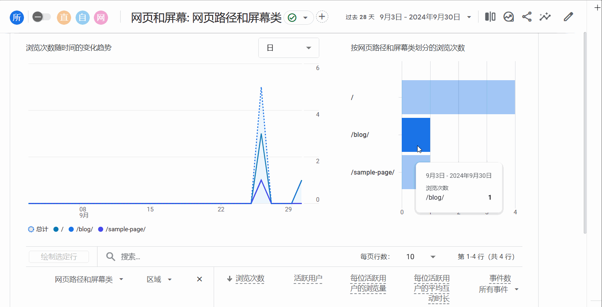
## 5.Conversions（转化/转化次数）
Conversions（转化/转化次数）报告会告诉你哪些用户活动有助于你的业务取得成功。 对于电子商务商店，这可能是购买。 对于潜在客户生成网站，它可能会提交联系表格。

在 GA4 中，“goals（目标）” 被衡量为转化事件。 你在 GA4 报告中看到的事件数据会在用户与你的网站互动时触发。

获取转化报告：

登入 Google Analytics
点击展开 Life Cycle（生命周期）报告
点击展开 Engagement（互动度）报告
点击 事件
在表格中，你会发现按名称、关联转化次数、总用户数、和事件收入列出的事件。 单击事件名称可打开有关该特定事件的报告。
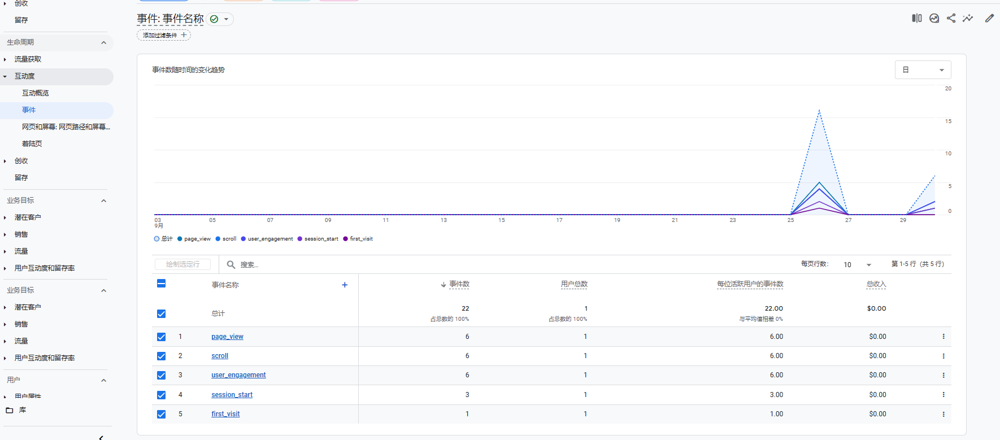
通过单击第 1 列旁边的蓝色加号图标，将二级维度（例如城市）添加到资源管理器表中。
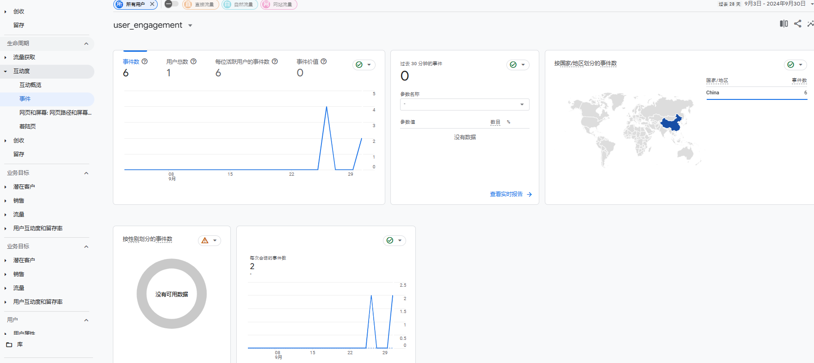
