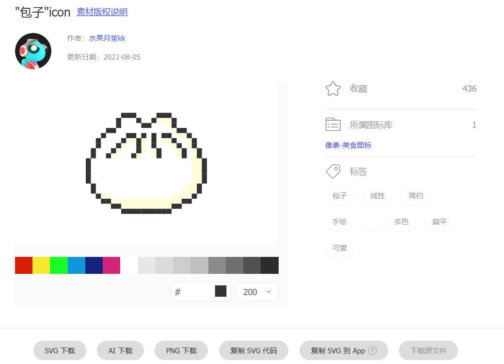
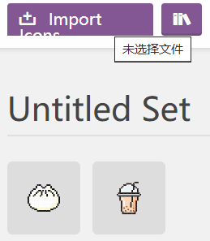
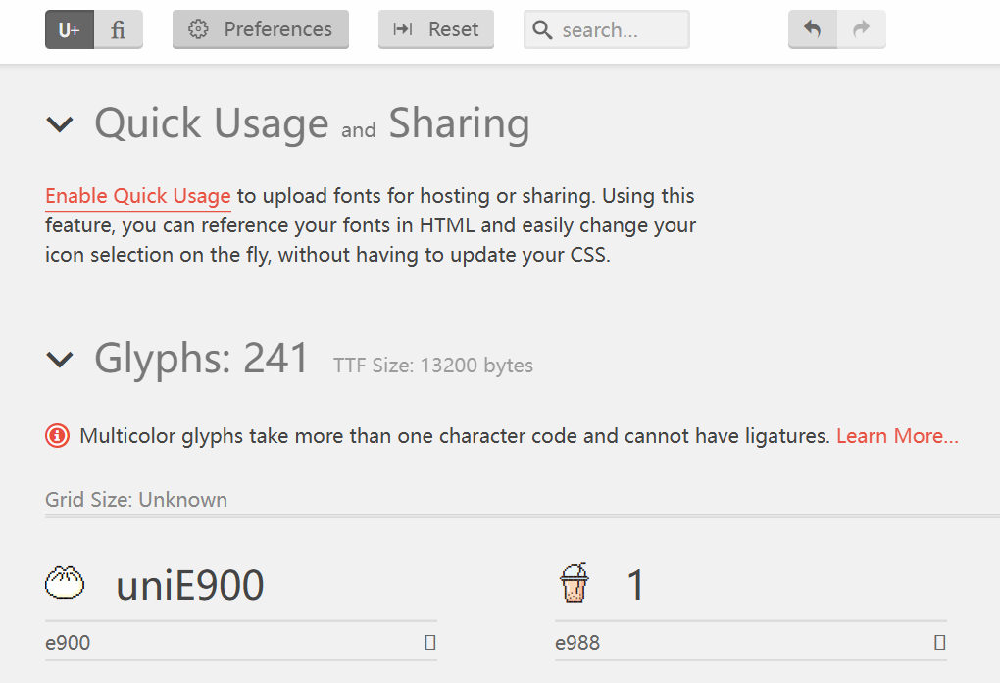
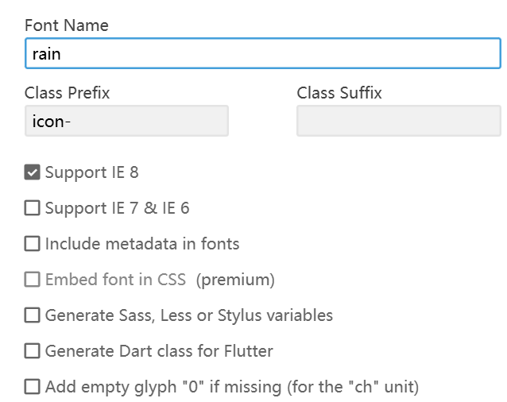

# 字体图标
## 基本概念
1. 基本概念：可以像使用字体一样使用图标
2. 优点：
- - 轻量性：一个图标字体比一系列的图像（特别是在retina屏幕中使用双倍图像）要小。一旦图标字体加载了，图标就会立马渲染出来，不需要下载一个图像。可以减少HTTP请求，还可以配合HTML5离线存储做性能优化。
- - 灵活性：图标字体可以用font-size属性设置其任何大小，还可以加各种文字效果，包括颜色、Hover状态、透明度、阴影和翻转等效果。可以在任何背景下显示。使用位图的话，必须得为每个不同大小和不同效果的图像输出一个不同文件。
- - 兼容性：网页字体支持所有现代浏览器，包括IE低版本
3. 缺点：
- 图标字体只能被渲染成单色或CSS渐变色，由于此限制使得它不能广泛使用
- 适用版本上有限制，有好多字体是收费的。当然也有很多免费开源的精美字体图标供下载使用
- 创作自己的字体图标很费时间，重构人员后期维护的成本偏高
4. 使用：
- @font-face
```
@font-face{
    font-family:<YourWebFontName>;
    src:<source>[<format>][,<source>[<format>]]*;
    [font-weight:<weight>];
    [font-style:<style>];
}
@font-face{
    font-family:'icomoon';
    src:url('fonts/icomoon.eot?ykb572');
    src:url('fonts/icomoon.eot?ykb572#iefix')
    format('embedded-opentype'),
    url('fonts/icomoon.ttf?ykb572')format('truetype'),
    url('fonts/icomoon.woff?ykb572')format('woff'),
    url('fonts/icomoon.svg?ykb572#icomoon')format('svg');
    font-weight:normal;
    font-style:normal;
}
```
## 案例
### 工具
- 阿里巴巴矢量图库：https://www.iconfont.cn/  (需要什么可以在这里面找)
- 可以SVG或AI下载


- 生成字体图标工具：https://icomoon.io/app/#/select
- 导入图标
- 在这里面选中要做的图标，点击生成字体图标：“Generate Font”

- 选中要选择的图标们-然后点击右下角生成，可见对应生成的字体图标有自己的编码和文档
- 点击上方的preference,设置一个自己要设置的名称，然后点击下载



# 伸缩布局
## Flex布局
- display:inline-flex;将对象作为弹性伸缩盒展示，用于行内元素
- display:flex; 将对象作为弹性伸缩盒展示，用于块级元素
## 常用属性
### flex-direction确定主轴
- flex-direction:用于指定Flex主轴的方向，继而决定Flex子项在Flex容器种的位置
- 取值：
- - row(默认值，表示水平方向从左到右排列，此时水平方向轴线为主轴)
- - row-reverse（与row相反）
- - column（表示垂直方向从上到下排列，此时垂直方向轴线为主轴）
- - column-reverse（与column相反）
```html
<!DOCTYPE html>
<html lang="en">
    <head>
        <meta charset="UTF-8">
        <title></title>
        <style>
            html{
                font-size:10px;
            }
            body{
                font-size:1.6rem;
            }
            #box1{
                width:50rem;
                height:50rem;
                background-color:skyblue;
                /*伸缩布局*/
                display:flex;
                /*控制主轴方向*/
                flex-direction:row;
            }
            .item{
                width:10rem;
                height:10rem;
                background-color:purple;
                margin:5px;
            }
        </style>
    </head>
    <body>
        <div id="box1">
            <div class="item">1</div>
            <div class="item">2</div>
            <div class="item">3</div>
        </div>
    </body>
</html>
```
### justify-content align-items确定轴中对其方式
- justify-content:用于指定主轴（水平方向）上Flex子项的对齐方式
- 取值：
- - flex-start（默认值，表示与行的起始位置对齐）
- - flex-end（表示与行的结束位置对其）
- - center（表示与行中间对齐）
- - space-between（表示两端对齐，中间间距相等。要注意特殊情况，当剩余空间为负数或者只有一个项时，效果等同于flex-start）
- - space-around（表示间距相等，中间间距是两端间距的2倍。要注意特殊情况，当剩余空间为负数或者只有一个项时，效果等同于center）
- align-items:用于指定侧轴（垂直方向）上flax子项的对齐方式
- 取值：
- - stretch(默认值，当flex子项未设置高度或者高度值为auto时，stretch起作用，将Flex子项高度设置为行高度。这里需要注意，在只有一行的情况下，行的高度为容器的高度，即Flex子项高度为容器的高度)
- - flex-start（表示与侧轴开始位置对齐）
- - flex-end（表示与侧轴结束位置对齐）
- - center（表示与侧轴中间对齐）
- - baseline（表示与基线对齐，当行内轴与侧轴在同一线上，即所有Flex子项的基线在同一线上时，效果等同于flex-start）
```html
<!DOCTYPE html>
<html lang="en">
    <head>
        <meta charset="UTF-8">
        <title></title>
        <style>
            html{
                font-size:10px;
            }
            body{
                font-size:1.6rem;
            }
            #box1{
                width:50rem;
                height:50rem;
                background-color:skyblue;
                /*伸缩布局*/
                display:flex;
                /*控制主轴方向*/
                flex-direction:row;
                /*主轴上子项对齐方式*/
                justify-content:space-around;
                /*侧轴上子项对齐方式*/
                align-items:streth;/*占据整个行高*/
                align-items:flex-start;/*以内容为行高，在垂直方向的起始*/
            }
            .item{
                width:10rem;
                /*height:10rem;*/
                background-color:purple;
                margin:5px;
            }
        </style>
    </head>
    <body>
        <div id="box1">
            <div class="item">1</div>
            <div class="item">2</div>
            <div class="item">3</div>
        </div>
    </body>
</html>
```
### flex-wrap用于指定Flex子项是否换行
- 取值：
- - nowrap(默认值，表示不换行，Flex子项可能会溢出)
- - wrap（表示换行，溢出的Flex子项会被放到下一行,顶对齐）
- - wrap-reverse（表示反方向换行，底对齐）
```html
<!DOCTYPE html>
<html lang="en">
    <head>
        <meta charset="UTF-8">
        <title></title>
        <style>
            html{
                font-size:10px;
            }
            body{
                font-size:1.6rem;
            }
            #box1{
                width:50rem;
                height:50rem;
                background-color:skyblue;
                /*伸缩布局*/
                display:flex;
                /*控制主轴方向*/
                flex-direction:row;
                /*指定主轴上的子项是否换行*/
                flex-wrap:wrap;
            }
            .item{
                background-color:purple;
                margin:5px;
            }
        </style>
    </head>
    <body>
        <div id="box1">
            <div class="item" style="width:6rem;height:6rem">1</div>
            <div class="item" style="width:7rem;height:7rem">2</div>
            <div class="item" style="width:3rem;height:3rem">3</div>
            <div class="item" style="width:6rem;height:6rem">1</div>
            <div class="item" style="width:7rem;height:7rem">2</div>
            <div class="item" style="width:3rem;height:3rem">3</div>
            <div class="item" style="width:6rem;height:6rem">1</div>
            <div class="item" style="width:7rem;height:7rem">2</div>
            <div class="item" style="width:3rem;height:3rem">3</div>
            <div class="item" style="width:6rem;height:6rem">1</div>
            <div class="item" style="width:7rem;height:7rem">2</div>
            <div class="item" style="width:3rem;height:3rem">3</div>
        </div>
    </body>
</html>
```
### align-self该属性单独制定某Flex子项的对齐方式
- 取值
- - auto
- - flex-start
- - flex-end
- - center
- - baseline
- - stretch
### align-content该属性只作用于多行的情况下，用于多行的对齐方式
- 取值：
- - stretch(默认值，当Flex子项未设置高度或者高度值为auto时，stretch起作用，将子项高度设置为行高度)
- - flex-start（表示各行与侧轴开始位置对齐，第一行紧靠侧轴开始边界，之后每一行都靠近前面一行）
- - flex-end（表示各行与侧轴结束位置对齐，最后一行紧靠侧轴结束边界，之后的每一行都紧靠前面一行）
- - center（表示各行与侧轴中间对齐）
- - space-between（表示两端对齐，中间间距相等。要注意特殊情况，当剩余空间为负数时，效果等同于flex-start）
- - space-around（表示各行之间间距相等，中间间距是两端间距的2倍。要注意特殊情况，当剩余空间为负数时，效果等同于center）
## 复合属性flex-响应式，跟随浏览器变大变小
- 复合属性flex是flex-grow/flex-shrink和flex-basis的简写属性，用来指定Flex子项如何分配空间
- flex-grow(默认值为0，若省略则被默认为1)
- flex-shrink（默认值为1，省略则默认为1）
- flex-basis（默认值auto，省略默认为0%）
```html
<!DOCTYPE html>
<html lang="en">
    <head>
        <meta charset="UTF-8">
        <title></title>
        <style>
            html{
                font-size:10px;
            }
            body{
                font-size:1.6rem;
            }
            #box1{
                width:80%;
                height:500rem;
                background-color:skyblue;
                /*伸缩布局*/
                display:flex;
                /*控制主轴方向*/
                flex-direction:row;
            }
            .item{
                background-color:purple;
                margin:5px;
            }
        </style>
    </head>
    <body>
        <div id="box1">
            <div class="item" style="flex:1;height:6rem">1</div><!--按照1：1：1的比例响应式变化-->
            <div class="item" style="flex:1;height:7rem">2</div>
            <div class="item" style="flex:1;height:3rem">3</div>
        </div>
    </body>
</html>
```